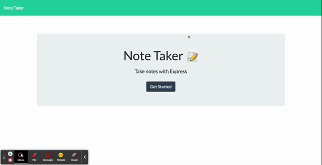

# Note Taker App
  
  
  ## Description
  This project was creating using express.js. The app allows the user to make notes of To-Dos that persists on the page by utilising API's and databases. 
   
   
  My motivation for this app was to create something that the user could use to help visualize and accomplish tasks.
   
   
  I built this app to be used as a tool for the everyday busy-body.
   
   
  This app will solve the problem of forgetting a task or anything. The user can check back in and pick up right where they left off by reading their notes.
   
   
  While bulding this app I learned a lot about express and routing! I utilized seperate files for each specific code, which presented me with challanges when it came to linking all the files togehter. 
  
  ## Table of Contents
  - [Description](#)
  - [Installation](#installation)
  - [Usage](#usage)
  - [License](#license)
  - [Credits](#credits)
  - [Links](#links)
  - [Screencaptures](#screencaptures)
  - [Tests](#tests)
  - [Questions](#questions)
  
  ## Installation
  This app is ran on HEROKU. Click the link below and you should be able to use a live version with no installation. 
  
  ## Usage
  This app will be used by the user to take notes on anything or as a task list.
  
  ## License
  MIT
  
  ## Credits
  Konner Hartman (myself)
    
  www.stackoverflow.com
    
  BCS Learning Assistance

  ## Links
  Repository:
  https://github.com/konnerhartman/Note-Taker
   
  Heroku Link:
  https://shielded-hollows-62643.herokuapp.com/
  
  ## Screencaptures
  

  ## Tests
  There are no tests.
  
  ## Questions
  Any questions can be directed to:
   
  Github: [konnerhartman](https://github.com/konnerhartman)
   
  Email: konner.hartman@yahoo.com
